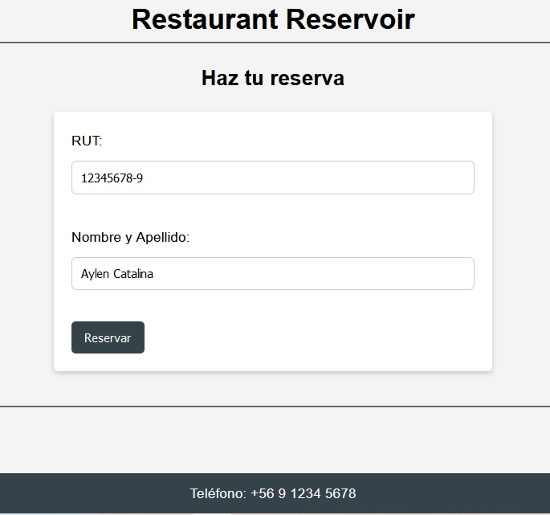
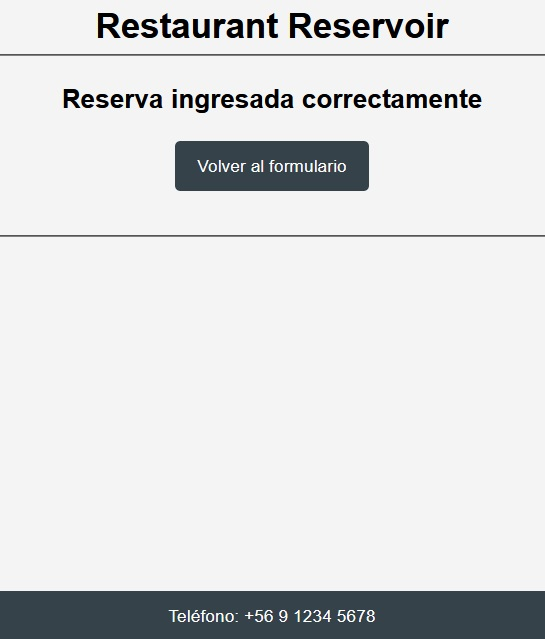

# Proyecto Restaurant Reservoir

Este proyecto es una aplicación web para gestionar reservas en un restaurante, desarrollada en PHP utilizando el patrón MVC.

## Características

- Formulario de reservas
- Confirmación de reservas
- Gestión de la base de datos

## Tecnologías Utilizadas

- PHP
- MySQL
- HTML5
- CSS3

## Capturas de Pantalla

### Formulario de Reserva

### Confirmación de Reserva

