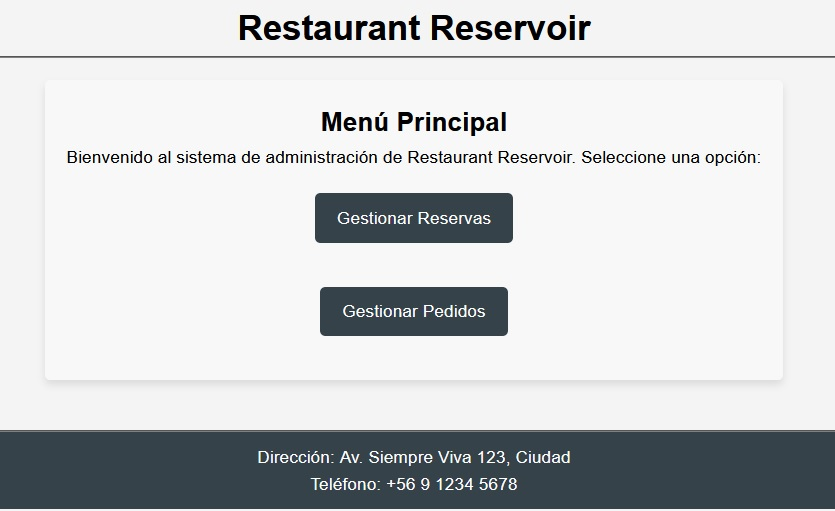
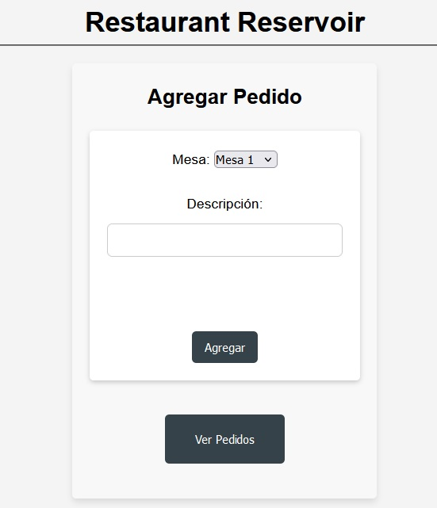
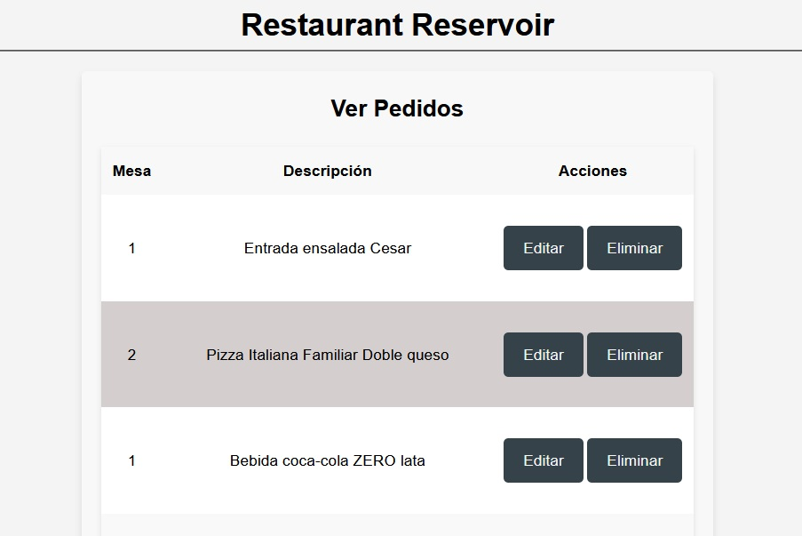

# Proyecto Restaurant Reservoir

Este proyecto es una aplicación web para gestionar reservas y pedidos en un restaurante, desarrollada en PHP utilizando el patrón MVC..

## Características

- Formulario de reservas
- Confirmación de reservas
- Gestión de la base de datos
- Gestión de pedidos (Agregar, Editar, Eliminar)
- Visualización de producción en tiempo real
- Sistema de login para el panel de administración
- Estilos responsivos para una mejor experiencia

## Tecnologías Utilizadas

- PHP
- MySQL
- HTML5
- CSS3

## Capturas de Pantalla

### Menú Principal

### Gestionar Pedidos

### Ver Pedidos

### Gestionar Reservas

### Confirmación de Reserva

